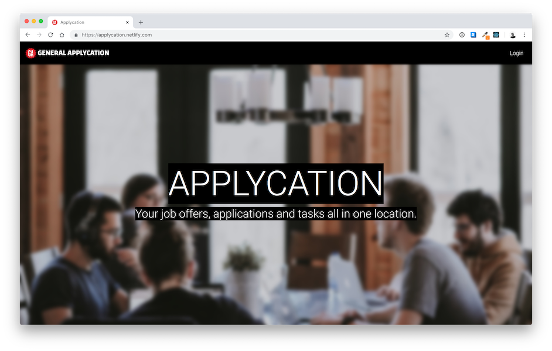

# Applycation



An app(lication) to apply and track applications. Get it?

## Features

- Track job offers, applications, interviews, contacts and more
- Easily sort active vs inactive applications

## Installation

Install dependencies.

```
yarn install
```

Start the app locally.

```
yarn start
```

### Hasura GraphQL

Headover to https://github.com/hasura/graphql-engine and deploy your own GraphQL Instance.

Tables needed to be created:

```
application, company, stage, poc, task, user
```

Columns / Relationships:

```
I'm working on a way to export the tables.
```

### Cloudinary

Set up an account with Cloudinary and created a unsigned preset for upload.

### Environment Variables

Create a .env file; paste and fill up the following variables.

```
touch .env

REACT_APP_HASURA_GRAPHQL_URL=<your hasura graphql endpoiint>
REACT_APP_HASURA_GRAPHQL_ACCESS_KEY=<your hasura access key>
REACT_APP_CLOUDINARY_PRESET=<cloudinary unsigned preset name>

```

## Technologies

- [React]() - Front-end
- [ReactStrap/MDBReact/Bootstrap]() - Material Design Bootstrap
- [Create-React-App]() - Scaffolding for React
- [Hasura GraphQL]() - Back-end / Database / API Endpoint
- [Cloudinary]() - Image upload

## Review

See post-morterm.md.
